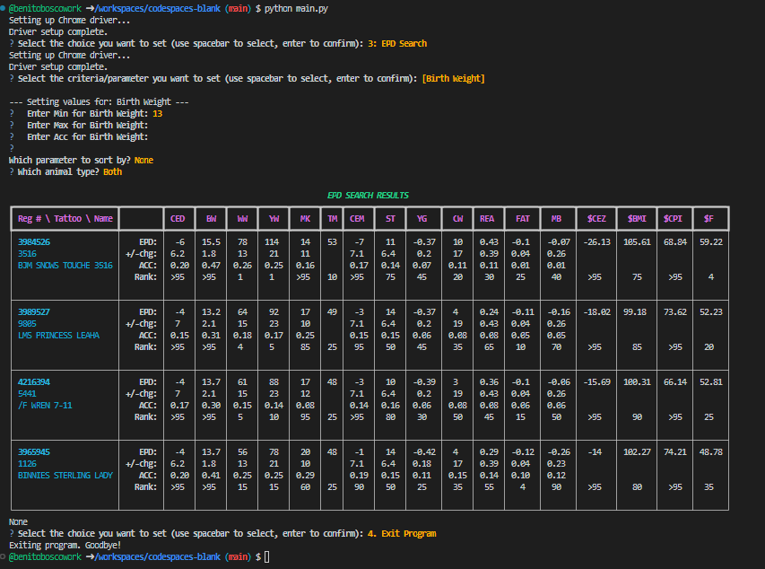
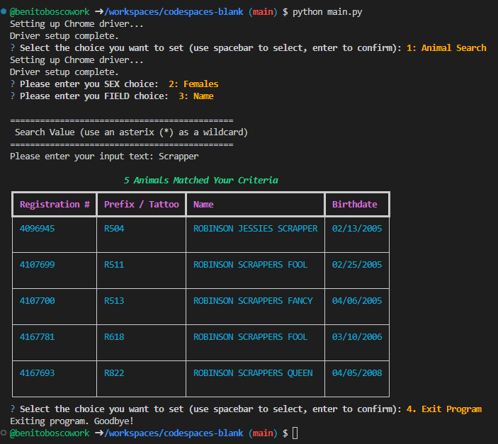

# Intelligent Shorthorn Web Scraper

[](https://opensource.org/licenses/MIT)

A command-line tool designed to simplify searching for Shorthorn cattle data on `shorthorn.digitalbeef.com`. It provides an interactive CLI to specify search criteria, automates the form-filling process, and scrapes the resulting data tables directly to your terminal.



---

## Table of Contents

- [Features](#features)
- [Disclaimer](#disclaimer)
- [Setup & Installation](#setup--installation)
  - [Option 1: Using GitHub Codespaces (Recommended)](#option-1-using-github-codespaces-recommended)
  - [Option 2: Local Installation](#option-2-local-installation)
- [Usage](#usage)
- [How It Works](#how-it-works)
- [License](#license)

---

## Features

-   **Interactive CLI**: Clean and user-friendly command-line interface built with `questionary` and `Rich`.
-   **Multiple Search Modes**: Supports three types of searches:
    -   Animal Search
    -   EPD (Expected Progeny Difference) Search
    -   Ranch Search
-   **Automated Form Filling**: Uses `Selenium` to programmatically enter your search criteria into the web forms.
-   **Data Scraping**: Parses the result tables from the website using `BeautifulSoup`.
-   **Formatted Output**: Displays the scraped data in a clean, readable table directly in your terminal.

---

## Disclaimer

This tool is intended for personal and educational purposes only. The user is responsible for ensuring their use of this script complies with the terms of service of any website it interacts with. The developers of this tool are not responsible for any misuse. Please use this script responsibly and ethically.

---

## Setup & Installation

You have two options for setting up this project. The recommended method is using GitHub Codespaces, which requires zero local setup.

### Option 1: Using GitHub Codespaces (Recommended)

This is the easiest way to run the script. It sets up a complete, ready-to-use development environment in the cloud with a single click.

1.  Navigate to the main page of this repository on GitHub.
2.  Click the green **`< > Code`** button.
3.  Go to the **Codespaces** tab.
4.  Click **"Create codespace on main"**.

GitHub will automatically build the development container based on the `.devcontainer/devcontainer.json` file. This includes installing Python, all necessary libraries from `requirements.txt`, and other required tools. Once the container is built (it may take a minute or two), a VS Code editor will open in your browser, and you can proceed directly to the [Usage](#usage) section.

### Option 2: Local Installation

If you prefer to run the script on your local machine, follow these steps.

#### 1. Prerequisites

Ensure you have the following installed on your system:
-   [Python 3.10+](https://www.python.org/downloads/)
-   [Git](https://git-scm.com/)
-   [Google Chrome](https://www.google.com/chrome/)

#### 2. Clone the Repository
Open your terminal and clone the repository:
```bash
git clone <URL_TO_YOUR_GITHUB_REPO>
cd <repository-folder-name>
```

#### 3. Set Up a Virtual Environment
It is highly recommended to use a virtual environment to manage dependencies.
```bash
# Create a virtual environment
python -m venv venv

# Activate it
# On macOS/Linux:
source venv/bin/activate
# On Windows:
venv\Scripts\activate
```

#### 4. Install Dependencies
Install all the required Python libraries.
```bash
pip install -r requirements.txt
```
*(Note: Ensure you have a `requirements.txt` file in your repository with the following content:)*
```
requests
beautifulsoup4
selenium
webdriver-manager
rich
questionary
```

#### 5. Set Up ChromeDriver
`Selenium` requires a `ChromeDriver` to control the Google Chrome browser.

1.  **Check your Chrome Version**: Go to `chrome://settings/help` in your Chrome browser to find your version (e.g., `108.0.5359.124`).
2.  **Download ChromeDriver**: Download the corresponding ChromeDriver version from the [official site](https://chromedriver.chromium.org/downloads).
3.  **Place the Driver**: Unzip the downloaded file and place the `chromedriver` (or `chromedriver.exe` on Windows) executable **in the root directory of this project**.

---

## Usage

Whether you are in a GitHub Codespace or a local setup, running the script is the same.

1.  Make sure you are in the project's root directory and your virtual environment is activated (if you are on a local setup).
2.  Run the main script from your terminal:
    ```bash
    python main.py
    ```
3.  The script will launch and present you with a menu to choose your search type (Animal, EPD, or Ranch).
4.  Follow the on-screen prompts to enter your search criteria.
5.  Once you've provided the input, the script will automatically open a Chrome browser, navigate to the website, fill in the form, and submit it.
6.  After scraping the results, the browser will close, and the data will be printed as a formatted table in your terminal.

---

## How It Works

This script orchestrates several powerful Python libraries to achieve its goal:

-   **`questionary` & `Rich`**: These libraries create the interactive and visually appealing command-line interface, making it easy for the user to provide input.
-   **`Selenium`**: Acts as the main browser automation engine. It launches a Chrome browser, navigates to pages, locates web form elements (like text boxes and buttons), and simulates user actions (typing and clicking).
-   **`BeautifulSoup4`**: Once Selenium has loaded the page with the search results, BeautifulSoup is used to parse the page's HTML. It excels at navigating the HTML tree and extracting specific data, such as the contents of the result tables.

---

## License

This project is licensed under the MIT License - see the [LICENSE](LICENSE) file for details.
